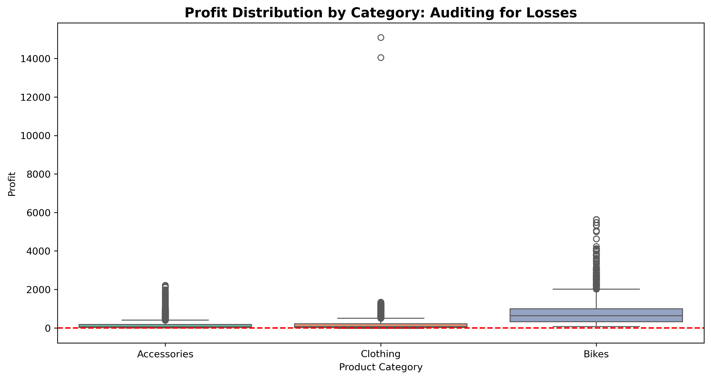
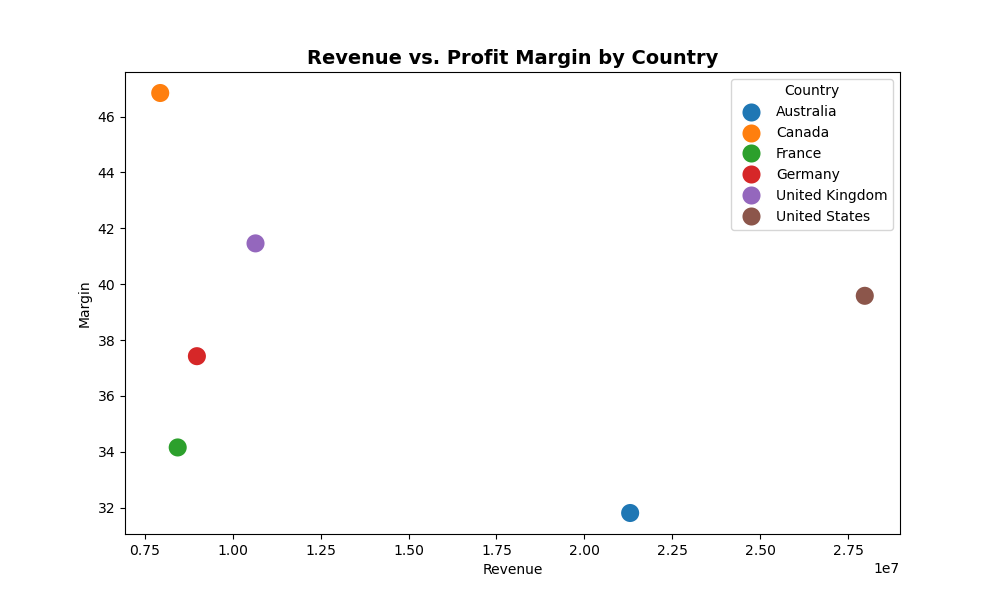
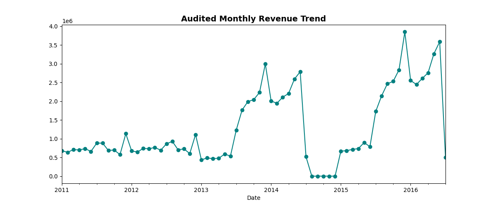

# Global Retail Sales: Audit & Optimization
**Standardizing and Auditing 113,000+ Records for Financial Accuracy**

##  Project Overview
This project involved auditing a massive retail dataset to ensure financial reporting accuracy. The primary challenge was "data noise"—including mixed date formats (e.g., "Fanuary") and text errors in numeric columns—that prevented automated analysis.

##  Tech Stack
- **Excel (Power Query):** Automated cleaning, date standardization, and ETL.
- **Python (Pandas/Seaborn):** Used for statistical auditing and trend validation.
- **Power BI:** Developed for final stakeholder visualization.

##  Audited Key Performance Indicators (KPIs)
| Metric | Value |
| :--- | :--- |
| **Total Revenue** | **$85,271,008** |
| **Total Profit** | **$32,221,100** |
| **Profit Margin** | **37.79%** |

##  Visual Insights
### 1. Profit & Loss Audit
By visualizing profit distribution, I identified that while the **Bikes** category drives the highest volume, specific models (like the **Mountain-500 Black**) are consistent "loss-leaders."

### 2. Country Performance
While the **United States** leads in total revenue, **Canada** maintains a significantly higher average profit margin, suggesting a more efficient operational model.

### 3. Revenue Trends (2011-2016)
The line chart below validates the data cleaning process; it shows a clean monthly trend, proving that the previously broken date formats have been successfully standardized.

##  Strategic Recommendations
1. **Price Review:** Investigate the pricing strategy for the "Mountain-500" series to mitigate losses.
2. **Operational Expansion:** Analyze Canadian logistics and marketing to replicate high-margin success in other regions.
3. **Automated Auditing:** Implement the developed Python scripts as a monthly "Data Health Check" to prevent future data noise.

##  Repository Contents
- `Global_Sales_Data_Audit_Report.pdf`: Formal business audit report.
- `cleaned_sales.xlsx`: Audited workbook with Pivot Table summaries.
- `Global_Audit_Visualizations.ipynb`: Python code for trend and outlier analysis.
